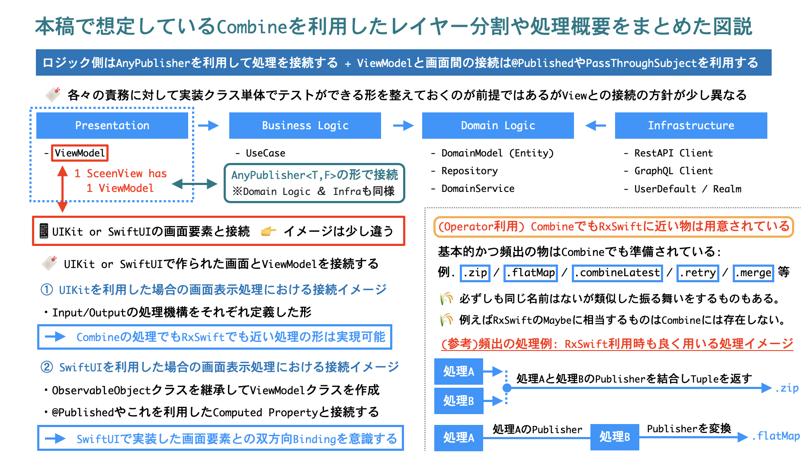
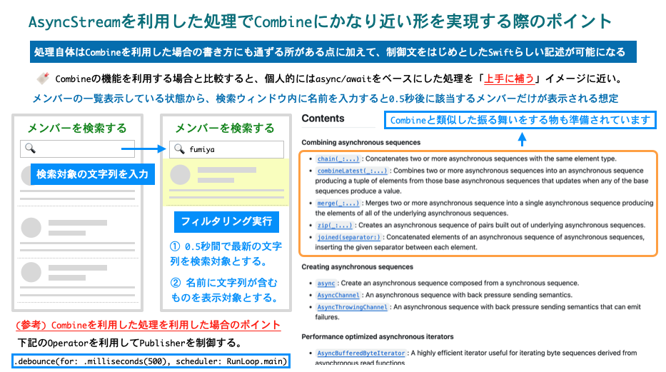

## Combineベースの実装をSwift Concurrencyへ少しずつ置き換えていく際のアイデアとヒントのご紹介

<p align="right">
<strong>酒井文也 (Fumiya Sakai) Twitter &amp; github: @fumiyasac</strong>
</p>

<hr>

### はじめに

アプリ開発において、UIから発火したイベント処理やネットワーク通信に関連する非同期イベント処理を上手く取り扱う必要がある場面や、画面要素と内部ロジックとを結合する処理を組み立てる必要がある場面においては、Combineを利用した実装や処理に触れる機会はまだまだあると思いますし、上手に活用する事で処理の見通しをより良い物にしたり、内部処理の統制をうまく取る役割を担う事もできます。Swift5.5から登場したSwift Concurrency（async/await）により、これまで以上に非同期処理や並列処理等のコードを書くためのサポートが充実した事で、Combineベースで記載した処理をよりシンプルかつ見通しの良い形へ改善していく余地も増えた様に感じております。とはいえ、既存の内部ロジック関連処理やView要素とのバインディング処理をCombineをベースをした形を取る場合においては、補う必要がある部分ではCombineを有効活用して補いながらも、アーキテクチャ内部の処理を徐々に置換する際には、段階的に処理を置換可能にするためのちょっとした工夫や考え方の方針があると心強いと思います。

本稿では、主に __Combineでの処理をasync/awaitへ置換する際の基本方針__ や __CombinePublisherが中心の構成から少しずつ置換するアプローチとアイデア__ の紹介から、 __Combineと比較したAsyncStream等の活用例__ や __async/awaitを利用する事で処理をシンプル化できた事例紹介__ についてもコードも交えながら簡単に解説できればと考えております。

対象の読者としましては __機能開発が活発な状態と並行しながら既存のコードをより新しくする改善を進める際のヒントを知りたい方__ や __Combineを利用した処理には触れた経験はあるがasync/awaitを利用した処理との関係性についてより理解を深めたい方__ 等を想定しております。決して特別な事はありませんが、ほんの少しでも皆様のご参考になる事ができれば嬉しく思います。

### 1. Combineでの処理をasync/awaitへ置換する際の基本方針

本稿では、MVVMアーキテクチャ（Model-ViewModel-View構成）を取る様な画面処理や内部ロジック処理部分に対して、想定する処理イメージを簡単に整理していくことにします。例えば、下記に示す様な形でViewModelクラス（Presentation層）以降の内部ロジック処理がレイヤー分割がなされ、全体的な処理機構をCombineを中心に据えた形で実装されている場合を想定し、階層に応じた優先順位を立てた上で処理を少しずつ段階的に置換していく場合を考えてみます。

__`ViewModel（Presentation層）⇄ UseCase（BusinessLogic層）⇄ Repository（DomainLogic層）⇄ APIClient・DataStore（Infrastructure層）`__

1. UseCase（BusinessLogic層）or Repository（DomainLogic層）
  👉 __各種処理の構造がシンプルであれば置換対応が進めやすく、比較的取り組みやすい部分__
2. APIClient・DataStore（Infrastructure層）
  👉 __各種処理の出発点となるため、まずは置換対応よりも「両方のケース対応可能な状態を作る」様な調整が良さそうな部分__
3. ViewModel（Presentation層）
  👉 __View要素に表示に関連する処理で利用する場合も多いので、まずは優先度はさほど高くなくても良さそうな部分__

__【🍨本稿で想定しているCombineを利用した全体処理のイメージ図解】__

- __（図解はこちらより引用）UIKit＆SwiftUIとCombineを組み合わせた処理で上手にUnitTestを整えていくアイデア解説:__
  - 記事URL: https://github.com/fumiyasac/iosdc2023_pamphlet_manuscript_vol2/blob/main/manuscript.md



### 2. CombinePublisherが中心の構成から少しずつ置換するアプローチとアイデア

ここからは、元々Combineベースで実装された処理を、段階的にasync/awaitを利用した処理に置き換えていく際の具体的なアイデアとアプローチ例について解説ができればと思います。

ViewModelクラス（Presentation層）と画面を構成するView要素（View層）に関連する処理については、Combineを活用した補助的な処理が有効な場合もあるため、本稿の第1章で解説した様に、まずはUseCaseクラス・Repositoryクラス（BusinessLogic層・DomainLogic層）の処理に対して、元々CombinePublisherを利用した処理を少しずつ置換する方針を取った方が、比較的イメージが掴みやすいかもしれません。

#### ⭐️2-1. AnyPublisherを変換するためのアプローチ

特に、大規模なアプリや元々の仕様が複雑な場合においては、新規開発時では可能な限りasync/awaitをベースに処理を組み立てるが、その際に既存処理が必要な場合でも柔軟に対応可能な状態にできると良さそうに思います。実現可能にする1つのアイデアとして、AnyPublisherに対してasync/awaitへ変換するためのExtensionを独自に定義する形についてご紹介します。

__【🌷AnyPublisherを変換するためのコード例】__

```swift
// ----------
// 📝 ① AnyPublisherをasync/awaitに変換するExtensionを定義例
// ----------

extension AnyPublisher {
    func async() async throws -> Output {
        try await withCheckedThrowingContinuation { continuation in
            var cancellable: AnyCancellable?
            // 👉 処理完了判定フラグ値
            var finishedWithoutValue = true
            // 👉 Combineの処理で成功時・失敗時の処理をハンドリングする
            cancellable = first()
                .sink { result in
                    switch result {
                    case .finished:
                        // 👉 エラーハンドリング1: 値を受け取らず処理終了となった場合
                        if finishedWithoutValue {
                            continuation.resume(throwing: AsyncError.finishedWithoutValue)
                        }
                    case let .failure(error):
                        // 👉 エラーハンドリング2: ServerError等で処理エラーとなった場合
                        continuation.resume(throwing: error)
                    }
                    cancellable?.cancel()
                }, receiveValue: { value in
                    // 👉 Success: 成功となった場合は、値を反映すると同時に処理完了フラグ変数を更新する
                    finishedWithoutValue = false
                    continuation.resume(with: .success(value))
                }
        }
    }
}

// ----------
// 📝 ② AnyPublisherで提供される処理をasync/awaitへ変換する
// ----------

func loadArticle() -> AnyPublisher<Article, Error> {
    // 👉 URLSessionで提供されているdataTaskPublisherを利用したAPI非同期通信処理
    URLSession.shared.dataTaskPublisher(for: "https://example.com")
        .map { $0.data }
        .decode(type: Article.self, decoder: JSONDecoder())
        .eraseToAnyPublisher()
}

// 👉 元の「AnyPublisher<Article, Error>型」を「async throws Article型」へ変換する
let article = try await loadArticle().async()
```

__【🍊参考資料】__

- __From Combine to Async/Await:__
  - 記事URL: https://medium.com/geekculture/from-combine-to-async-await-c08bf1d15b77

この様な処理を応用する事で、Combineを利用をしてAPIリクエスト関連処理を共通化した処理に対して、async/awaitへ変換する処理例を考えてみます。後述するコードでは最終的にはAPIリクエスト処理結果を「Future<T,F>型（※すなわちRxSwiftのSingleオペレータの様に成功・失敗いずれかのイベントを1度だけ流す様な形とほぼ同様な処理）」で値を返却する想定ですが、 __`①Future<T,F> → ②AnyPublisher<T,F> → ③async/await`__ の様な形で変換する事が可能です。

__【🌷共通化されたAPIリクエスト関連処理におけるコード例】__

```swift
// ----------
// 📝 ① Future<T,F>型を利用したAPIリクエスト関連処理を共通化した処理クラスの抜粋（Singleton Instance定義）
// ----------

class APIRequestManager {

    // … ※ Property定義等は省略しています …

    func handleSessionTask<T: Decodable & Hashable>(_ dataType: T.Type, request: URLRequest) -> Future<[T], APIError> {
        return Future { promise in
            let task = self.session.dataTask(with: request) { data, response, error in

                // 👉 Response形式やStatusCodeを元にしたエラーハンドリングを実施する（※具体的な処理記述は省略しています）

                // 👉 取得したResponseを引数で指定した型の配列に変換して受け取る
                do {
                    let hashableObjects = try JSONDecoder().decode([T].self, from: data)
                    promise(.success(hashableObjects))
                } catch {
                    promise(.failure(APIError.error(error.localizedDescription)))
                }
            }
            task.resume()
        }
    }
}

// ----------
// 📝 ② APIリクエスト関連処理を利用する際にはasync/await前提の処理に変換する
// ----------

let result = try await APIRequestManager.shared
    .handleSessionTask([Article].self, request: request)
    .eraseToAnyPublisher()
    .async()
```

ここまでは、AnyPublisherをasync/awaitに変換するExtension例を紹介しましたが、別解として、CombineのPublisher自体に対してasync/awaitに変換するExtensionを定義して利用するアプローチも同様に良いかと思います。ポイントはCombineのストリームをAsyncSequenceとして処理する際に`.values`に注目する点になります。（この方法は私にとっては「目から鱗」でした！素敵な解説記事を本当にありがとうございました🙏）

- __values (Combine / Publisher):__
  - 公式ドキュメントURL: https://developer.apple.com/documentation/combine/publisher/values-1dm9r

__【🌷Publisherに対してExtensionを定義する場合のコード例】__

```swift
// ----------
// 📝 ① AsyncSequenceプロトコルへ準拠している点を利用したExtensionを定義する
// ----------

extension Publisher where Failure == Never {
    var asyncValue: Output {
        get async {
            // 👉 ここで「.values」が返却するのは`AsyncPublisher`である点に注目する
            await self.first().values.first { _ in true }!
        }
    }
}

extension Publisher {
    var asyncThrowingValue: Output {
        get async throws {
            // 👉 ここで「.values」が返却するのは`AsyncThrowingPublisher`である点に注目する
            try await self.first().values.first { _ in true }!
        }
    }
}

// ※ .first { ... } の処理では、AsyncSequenceの最初の値を返しています。

// ----------
// 📝 ② dataTaskPublisherで実行される処理をasync/awaitへ変換する
// ----------

// 👉 Publisher → AsyncSequence → async/awaitの順番で変換される
func fetchArticlesWithError() async throws -> [Article] {
     try await URLSession.shared.dataTaskPublisher(for: URL(string: "https://example.com")!)
         .map(\.data)
         .decode(type: [Article].self, decoder: JSONDecoder())
         .asyncThrowingValue
 }
```

__【🍊参考資料】__

- __Combine PublisherをSwift Concurrencyに変換する:__
  - 記事URL: https://qiita.com/hyuga_amazia/items/2ce629916c2a088d1ecb

#### ⭐️2-2. Combineで実現していた直列・並列処理を書き換える際のアプローチ

Combineを利用する処理において、ViewModelクラス（Presentation層）・UseCaseクラス（BusinessLogic層）の様に、任意の処理や機能を実現するために、複数クラスの処理をCombineで提供されているOperatorを有効活用する事で処理を繋げ、題意を満たす形を作る様な場面は多々あるかと思います。全てのOperatorを置換できる訳ではありませんが、比較的シンプルな処理を繋げる様な場合においては、async/awaitを利用した処理に置換可能な余地もあるかと思います。

ここでは、Operatorでも特に利用頻度が高そうな`.flatMap`・`.Zip`の2つを利用したシンプルな直列処理・並列処理を題材として、Combineからasync/awaitへ置換する際のコード例をご紹介します。

__【🌷何らかの処理結果を順次利用していく場合のコード例】__

```swift
// ----------
// 📝 (前提) とある関数の処理結果を利用して実行する処理があると仮定する
// ----------

func first() -> AnyPublisher<T2, Error> {
    return Future<T2, Error> { promise in
        promise(.success(T2()))
    }
    .eraseToAnyPublisher()
}

func second(_ value: T2) -> AnyPublisher<T3, Error> {
    return Future<T3, Error> { promise in
        promise(.success(T3()))
    }
    .eraseToAnyPublisher()
}

func third(_ value: T3) -> AnyPublisher<T4, Error> {
    return Future<T4, Error> { promise in
        promise(.success(T4()))
    }
    .eraseToAnyPublisher()
}

// ----------
// 📝 ① Combineを利用して処理1→処理2→処理3の順番で直列処理をする例
// ----------

first()
    .flatMap { self.second($0) }
    .flatMap { self.third($0) }
    .sink(receiveCompletion: { result in
        // 👉 完了時 or 失敗時のHandling処理
    }, receiveValue: { t4 in
        // T4型の値を利用した処理
    })

// ----------
// 📝 ② async/awaitを利用して処理1→処理2→処理3の順番で直列処理をする例
// ----------

// 👉 do ~ catch 内で下記の様な処理を実行（※処理途中でError発生時はcatch内の処理が実行されます。）
let firstResult = try await first()
let secondResult = try await second(firstResult)
let thirdResult = try await third(secondResult)
```

__【🌷全ての処理完了を待って正常な場合に何らかの処理を実行するコード例】__

```swift
// ----------
// 📝 (前提) とある関数の処理結果を利用して実行する処理があると仮定する
// ----------

func firstPublisher() -> AnyPublisher<T1, Error> {
    return Future<T1, Error> { promise in
        promise(.success(T1()))
    }
    .eraseToAnyPublisher()
}

func secondPublisher() -> AnyPublisher<T2, Error> {
    return Future<T2, Error> { promise in
        promise(.success(T2()))
    }
    .eraseToAnyPublisher()
}

func thirdPublisher() -> AnyPublisher<T3, Error> {
    return Future<T3, Error> { promise in
        promise(.success(T3()))
    }
    .eraseToAnyPublisher()
}

// ----------
// 📝 ① Combineを利用して処理1・処理2・処理3の完了を待つ並列処理をする例
// ----------

let zippedPublisher = Publishers.Zip3(
    firstPublisher(),
    secondPublisher(),
    thirdPublisher()
)
.sink(receiveCompletion: { result in
    // 完了時 or 失敗時のHandling処理
}, receiveValue: { t1, t2, t3 in
    // T1,T2,T3型の値を利用した処理
})

// ----------
// 📝 ② async/awaitを利用して処理1・処理2・処理3の完了を待つ並列処理をする例
// ----------

// 👉 do ~ catch 内で下記の様な処理を実行（※処理途中でError発生時はcatch内の処理が実行されます。）
async let firstResult = try await first()
async let secondResult = try await second()
async let thirdResult = try await third()
```

### 3. Combineと比較したAsyncStream等の活用例

__【🍨Combineで実装した処理をAsyncStreamへ置換する際のポイント図解】__



__【🌷AsyncStramを利用した検索バーからの名前フィルタ処理を実現するコード例】__

```swift
// ----------
// 📝 ① メンバー検索画面の構造例
// ----------

struct MembersView: View {

    // MARK: - ViewModel

    // 一覧表示用のView要素処理で利用するViewModelクラス
    // 🍀 MEMO: ViewModelクラスについては外部からDIをする想定です。
    @ObservedObject var viewModel: MembersViewModel

    // MARK: - Body

    var body: some View {

        NavigationStack {

            // 👉 ViewModel内の「変数: filteredMembers」の内容を一覧表示する
            List(viewModel.filteredMembers) { member in
                MemberView(member: member)
            }
            // 👉 検索ウインドウ経由で入力された文字列とViewModel内の「変数: query」をBindingする
            .searchable(text: $viewModel.query)
            .navigationBarTitle(Text("メンバー検索"))
            .navigationBarTitleDisplayMode(.inline)
        }

        // 🍀 MEMO: .task { ... } を利用して画面が再表示された際の結果の重複を回避する。
        .task {
            // 👉 ViewModelに定義したメンバーの一覧を取得処理を実行する
            await viewModel.fetchMembers()
        }
    }
}

// ----------
// 📝 ② メンバー検索画面で利用するViewModelクラスの構造例
// ----------

// 👉 パッケージ「swift-async-algorithms」を利用するimport宣言
import AsyncAlgorithms

@MainActor
class MembersViewModel: ObservableObject {

    // MARK: - Property

    // 名前でフィルタされた状態を含むメンバー表示リストを格納するためのProperty
    @Published var filteredMembers: [Member] = []

    // 検索バーに入力された検索フィルタ用文字列を格納するためのProperty
    @Published var query: String = "" 

    // 現在登録されているメンバーの一覧を取得するためのUseCaseクラス（BusinessLogic層）
    private let getMembersUseCase: GetMembersUseCase

    // MARK: - Initializer

    init(membersRepository: MembersRepository) {
        self.membersRepository = membersRepository
    }

    // MARK: - Function

    // 画面表示が開始された際に現在登録されているメンバーの一覧を取得する
    func fetchMembers() async {

        // 👉 async/awaitを前提とした処理にする
        do {

            // (1) GetMembersUseCaseからのデータ取得処理による変化をAsyncStreamで扱う様にする
            let membersStream = asyncStream(for: getMembersUseCase.execute)
            
            // (2) 入力された文字列変数の変化をAsyncStreamで扱う様にする
            let queryStream = $query
                .debounce(for: 0.5, scheduler: DispatchQueue.main)
                .values
            
            // (3) 2つのAsyncStreamを繋ぎ合わせる事で、文字列を含む名前によるフィルタ処理を実行する
            // 🍀 MEMO: この処理では「swift-async-algorithms」で提供されているcombineLatestを利用する。
            for try await (members, query) in combineLatest(membersStream, queryStream) {
                self.filteredMembers = members
                    .filter { query.isEmpty || $0.name.localizedCaseInsensitiveContains(query) }
            }

        } catch {
            // 🍀 MEMO: 厳密には処理失敗時にはエラーの旨を通知する様なダイアログ等を準備する方が望ましい。
            print("Fetch Members Error: " + error.localizedDescription)
        }
    }
}
```

__【🍊参考資料】__

- __swift-async-algorithms:__
  - 記事URL: https://github.com/apple/swift-async-algorithms
- __Using new Swift Async Algorithms package to close the gap on Combine:__
  - 記事URL: https://johnoreilly.dev/posts/swift-async-algorithms-combine/

### 4. async/awaitを利用する事で処理をシンプル化できた事例紹介

最後に、具体的な画面内部処理と機能を実現するにあたり、async/awaitベースの処理を利用する事で、より直感的な形で一筋縄ではいかない機能を実現できた事例について解説できればと思います。ここで紹介するのは、BackendではFirebaseを利用したアプリ機能において、Firebase Storageを利用して複数枚の画像を順番を担保した状態でまとめてアップロードする機能になります。

```swift
// 👉 Firebase Storageで提供される、ファイルアップロード処理をasync/awaitベースで実行可能にするもの
func putDataAsync(
    _ uploadData: Data,                      // 🍀 MEMO: ① アップロード対象ファイルデータ
    metadata: StorageMetadata? = nil,        // 🍀 MEMO: ② アップロード対象ファイルメタデータ
    onProgress: ((Progress?) -> Void)? = nil // 🍀 MEMO: ③ 処理の進行状況を示すClosure
) async throws -> StorageMetadata
```

__【🍨複数枚の画像の順番を担保した状態でアップロードをする機能例】__


__【✍️大まかな仕様を洗い出す】__

- __① 投稿したい写真を選択:__
  - 点線部分をタップすると、UIPickerViewController等で投稿対象の写真を選択する。
    👉 __取得したUIImageを表示する__
- __② 選択されている写真を操作:__
  - 右上の閉じるボタンを押下する。
    👉 __対象の画像要素を削除する__
    👉 __indexの最後以外の場合は画像要素を詰めて表示する__
  - 再度画像表示エリアをタップする。
    👉 __再び対象indexにおける投稿対象の写真を選択する__
- __③ 写真を投稿するボタンの状態:__
  - 写真が1枚も投稿していない場合にはボタンは非活性状態となる。
  - 写真が最低1枚投稿している場合にはボタンは活性状態となる。

__【🌷画像アップロード処理におけるポイントとなる部分のコード抜粋】__

```swift
// ----------
// 📝 ① 複数枚の画像の順番を担保した状態でアップロードをするBusiness Logic（UseCase）クラスの定義例
// ----------

// MARK: - Enum 

// 👉 複数画像要素のアップロード処理結果を示すもの
enum UploadImagesResult {
    case none
    case loading
    case success
    case failure
}

final class PostShopImagesUseCaseImpl: PostShopImagesUseCase {

    // MARK: - Function

    func uploadShopImages(shopID: String, images: [UIImage]) async -> UploadImagesResult {
        return await uploadImagesToFireStorage(shopID: shopID, images: images)
    }

    // MARK: - Private Function

    private func uploadImagesToFireStorage(shopID: String, images: [UIImage]) async -> UploadImagesResult {
        // 👉 `putDataAsync`を活用して複数枚の画像を順次アップロードする
    }
}

// ----------
// 📝 ② `putDataAsync`を活用して複数枚の画像を順次アップロードする処理における重要なポイント
// ----------

var uploadSuccessCount: Int = 0

// 👉 アップロード対象の複数画像要素に対して順次処理を実行する
// ※ for ... in を利用したループ処理で実行する方針としています。
for (i, image) in images.enumerated() {

    // (1) 受け取ったUIImage型をData型に変換する
    // ※ compressionQualityの値は仕様に応じて決定する
    let data = image.jpegData(compressionQuality: 0.5)!

    // (2) Metadata設定
    let metadata = StorageMetadata()
    metadata.contentType = "image/jpeg"

    // (3) アップロード画像の配置場所を設定する
    // ※ 配置するパス情報については仕様に応じて決定する
    // パス情報設定例: shop_images/{shopID}/{YYYYMMDD}/{YYYYMMDD_(1...5).jpg}
    let imageDirectory = "... パス情報の文字列 ..."
    let storageReference = Storage.storage(url: storageUrl).reference()
    guard let reference = storageReference?.child(imageDirectory) else {
        assertionFailure("referenceの設定に失敗しました。")
        break
    }

    // (4) `putDataAsync`を利用して「Firebase Storage」へ向けて画像アップロード処理を実行する
    // ※ ループ処理実行中の画面表示はIndicator等を表示する想定です。
    do {
        // 🍀 MEMO: ファイルアップロード処理成功時はこの場合はuploadSuccessCountを+1する。
        _ = try await reference.putDataAsync(data, metadata: metadata)
        uploadSuccessCount += 1
    } catch let error {
        // 🍀 MEMO: 厳密にはファイルアップロード処理に失敗した画像があればログ送信等をする方が望ましい。
        print("File Upload Error: " + error.localizedDescription)
    }
}

// 👉 成功時 or 失敗時のハンドリング処理を実行する
// ※ この処理ではアップロードに成功したものが1つでもあった場合には成功と見なしています。
return (uploadSuccessCount > 0) ? .success  : .failure
```

__【🍊参考資料】__

- __Firebase Realtime Database ＆ Firebase Storageでasync/awaitを利用した簡単な処理実装例の紹介:__
  - 記事URL:　https://qiita.com/fumiyasac@github/items/22f539f554981da6afb0

### まとめ

本稿で解説した比較的シンプルなコードで変換する事例や画面処理イメージを交えた処理概要については、元々実装されている処理を大きく崩す事なく、徐々に理想的な形へ置き換えていく際におけるアイデアやヒントの1つに過ぎないかも知れませんが、特に、CombinePublisherを中心とした処理を置き換えていく場合においては、様々な処理の選択肢はあると思いますので、現在開発中のアプリにおける事情に合わせて適切な選択ができれば良さそうに思います。

理解を深めたり知見を広げていくために、Combineを活用した処理事例に触れる事に加えて、AsyncStream・AsyncSequence・async/await等を活用した事例に少しずつ触れてみたり、CombinePublisherを置換する様なExtension等の有効活用する様な小さなアイデアを少しずつ試していく事が、全体的に置き換えていく方針を考える際の1歩目に繋がっていくと考えています。また、本稿でピックアップした様なFirebaseStorageを利用した写真を複数枚アップロードする画面処理の事例の様に、これまでは難しく面倒だと感じていた処理に対してasync/awaitを利用した処理に置き換える事で、より直感的かつ理解しやすい形のコードで書ける例を調査する取り組みについても、より理解やイメージを膨らませる事に役立つと思います。

私自身もまだまだ完璧に理解し切っている訳ではありませんが、Swift Concurrencyを利用した処理や実装に向き合う機会や時間が今後はより一層増えていくと思うので、iOSやSwiftの早い進化に対しても素早くキャッチアップをしながら、便利な新機能をプロダクションコードへ上手に活用することや、更なる改善を加えてより良いものにするためのアイデアや実現手段を模索して行ければと改めて感じた次第です。
